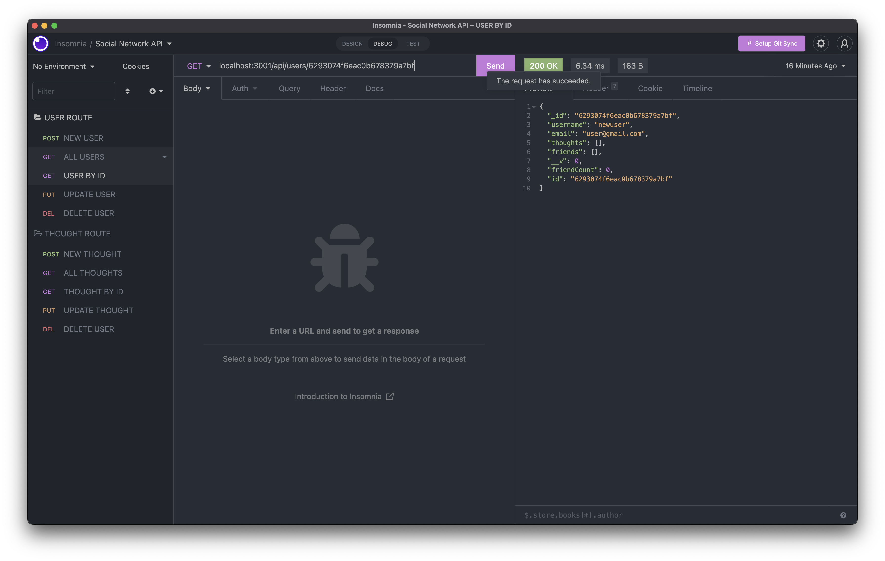

# Social Network API

## **Description**

This application demonstrates a social network API that allows one to CRUD users and thoughts with a MongoDB database. The application utilizes the Express.js library for routing and the Mongoose for data modeling.

## **Video Demonstration**

[YouTube video demonstration](https://www.youtube.com/watch?v=LdJR9QV2e0g) of social network API.

## **Screenshots**
